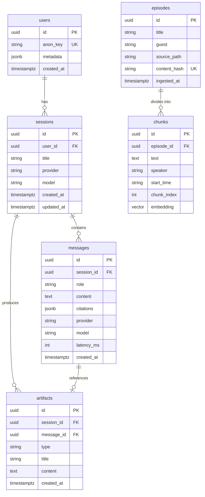
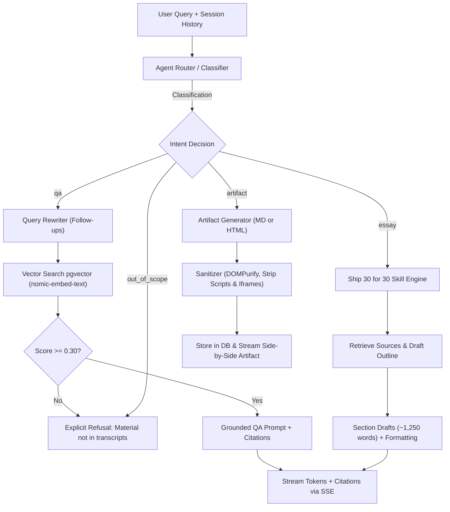
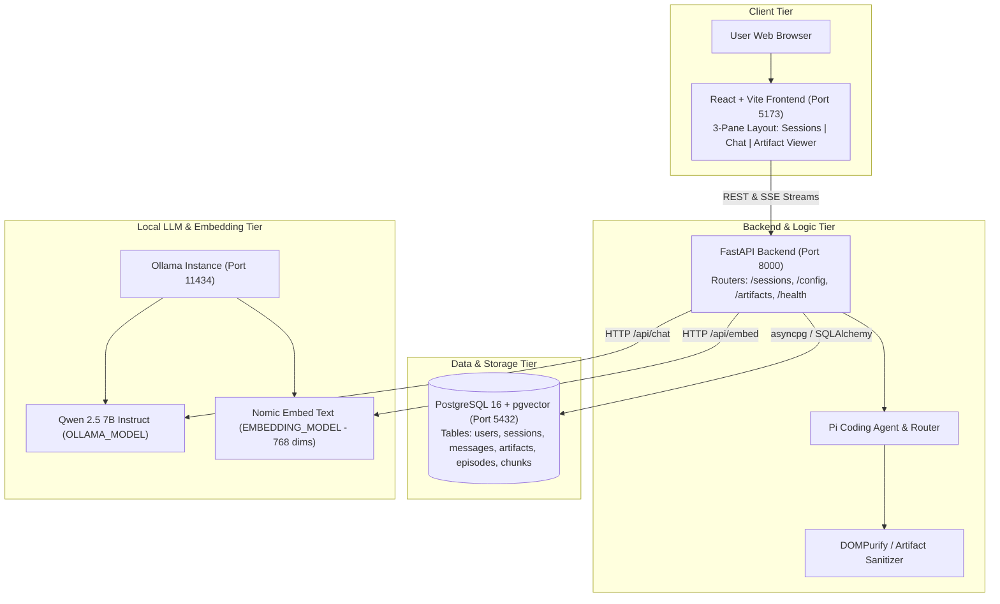

# Lenny Growth Assistant — System Design Skeleton

Scaffold only: component boundaries, contracts, and schemas. Paste into `docs/architecture.md` and expand as you build. Table names, endpoint paths, and error codes are fixed by the brief and the plan.

---

## 0. Decisions Locked (Plan 4.1)

| Decision | Choice | Reason |
|---|---|---|
| Backend | FastAPI + SQLAlchemy 2 (async) + asyncpg | Typed models, validation, little boilerplate |
| Frontend | React + Vite | Static build, no SSR needed, simple container |
| Database | PostgreSQL + pgvector (local Docker) | One DB for chats and vectors; no paid hosting |
| Embeddings | Ollama `nomic-embed-text` (768 dims), both modes | Free, local, same index whichever chat model is active |
| Chat model (default) | Ollama `qwen2.5:7b-instruct` (Q4); fallback `qwen2.5:3b` | **7b preferred** (~15–35 tok/s, better essay/routing quality); drop to 3b (~40–80 tok/s) only if first-token latency >30 s or RAM swaps |
| Agent layer | **Pi Coding Agent** (spike result: chosen) — thin orchestrator behind the provider interface; no Claude SDK dependency | No paid API key required; Pi talks to any OpenAI-compatible endpoint incl. Ollama |
| Cloud LLM | One OpenAI-compatible provider class (configurable base URL, key optional) | Satisfies "one cloud provider" without paid usage |
| Streaming | Server-Sent Events | One-way server → client is enough |
| Identity | Anonymous browser UUID in `localStorage`, sent as a header; stored in `users.anon_key` | No auth system (documented scope choice) |

**Spike result:** ✅ **Pi Coding Agent chosen.** Pi exposes an OpenAI-compatible client interface, so it routes calls through our provider layer to Ollama without modification. No cloud SDK dependency required. The thin provider interface wraps Pi's client so the app never calls Pi or Ollama directly — switching remains a config-only change.

---

## 1. Component Overview

```
[Frontend: React + Vite]
        |  (REST + SSE)
        v
[FastAPI app]
   ├── routers/     -> HTTP contracts (sessions, messages, config, artifacts, admin, health)
   ├── agents/      -> intent router + flows (qa | essay | artifact | out_of_scope)
   ├── skills/      -> ship30_essay (SKILL.md-style, not a one-off prompt)
   ├── services/
   │     ├── retrieval  -> chunking, embeddings, vector search, traceability
   │     ├── providers  -> provider interface (Ollama / OpenAI-compatible)
   │     └── artifacts  -> generation, validation, sanitization, storage
   ├── db/          -> SQLAlchemy models + Alembic or init SQL
   └── core/        -> settings (pydantic-settings), logging, exception handler, request-id middleware
        |
        v
[PostgreSQL + pgvector]     [Ollama (local, free)]     [Optional: OpenAI-compatible endpoint]
```

Why this shape: one database keeps Compose simple; a thin provider interface isolates the model from application code ("switchable via config only"); routing sits above retrieval and skills so qa, essay, and artifact share one entry point.

---

## 2. Database Schema (draft; full types in Plan 4.2)

| Table | Key columns |
|---|---|
| `users` | id, anon_key, metadata (jsonb), created_at |
| `sessions` | id, user_id, title, provider, model, created_at, updated_at |
| `messages` | id, session_id, role, content, citations (jsonb), provider, model, latency_ms, created_at |
| `artifacts` | id, session_id, message_id, type (markdown/html), title, content, created_at |
| `episodes` | id, title, guest, source_path/url, content_hash, ingested_at |
| `chunks` | id, episode_id, text, speaker, start_time, chunk_index, embedding vector(768) |

- Indexes: `messages(session_id, created_at)`; vector index on `chunks.embedding`.
- `sessions.user_id` and `messages.session_id` enforce independent sessions (never one global conversation).
- [x] Draw ER diagram



---

## 3. API Contract — LOCKED 4.3

All schemas are in `backend/app/core/schemas.py`.
Every `/sessions` and `/artifacts` request carries `X-Anon-Key: <browser-uuid>`.
The backend finds or creates the `users` row from it.

| Method | Path | Request body | Response |
|---|---|---|---|
| GET | `/health` | — | `{"status": "ok"}` |
| GET | `/health/ready` | — | `ReadyOut` |
| POST | `/sessions` | `SessionCreate` | `SessionOut` |
| GET | `/sessions` | — | `list[SessionOut]` |
| GET | `/sessions/{id}` | — | `SessionDetail` |
| POST | `/sessions/{id}/messages` | `MessageCreate` | SSE stream (see below) |
| GET | `/config/providers` | — | `ProvidersOut` |
| GET | `/artifacts/{id}` | — | `ArtifactOut` |
| POST | `/admin/ingest` | — | `IngestResult` |

- One error shape everywhere: `{ "error": { "code", "message", "request_id" } }`
- Global exception handler maps every error to this shape; raw stack traces never returned.
- Request-ID middleware binds `request_id` to logs and error payloads.

### Error code → HTTP status

| Code | HTTP |
|---|---|
| `VALIDATION_ERROR` | 422 |
| `MODEL_UNAVAILABLE` | 503 |
| `MODEL_TIMEOUT` | 504 |
| `DB_UNAVAILABLE` | 503 |
| `MISSING_API_KEY` | 503 |
| `NO_RELEVANT_SOURCES` | — (not an HTTP error; see below) |

### SSE stream — `POST /sessions/{id}/messages`

| Event | Data shape | UI use |
|---|---|---|
| `status` | `{"stage": "retrieving" \| "generating"}` | Progress indicator |
| `token` | `{"text": "..."}` | Streaming text append |
| `citations` | `[Citation, ...]` | Source chips |
| `artifact` | `ArtifactSummary` | Opens artifact viewer |
| `done` | `{"message_id": "...", "no_sources": false}` | Ends stream |
| `error` | `ErrorBody` | Friendly error message |

### Design decisions (locked)

1. **`NO_RELEVANT_SOURCES` is not an HTTP error.** Refusing to answer is expected product behaviour — not a failure. The assistant streams a clear "transcripts don't cover this" reply; `done` carries `no_sources: true`. Logged for refusal-rate measurement (plan success metric ≥ 90%).
2. **`/admin/ingest` has no authentication.** Local-only endpoint; fits the no-auth scope choice. Documented in README.

---

## 4. Agent Routing Design

- Router classifies intent: `qa | essay | artifact | out_of_scope`, with a rule-based fallback if the local model misroutes.
- Tools/skills: `retrieve_transcripts`, `ship30_essay` (skill), `create_artifact`.
- Flows are **fixed pipelines in code** (small local models are weak at choosing tools); the model fills in text at each step.
- **qa:** rewrite follow-up into a standalone query → retrieve → similarity threshold → answer with citations, or `NO_RELEVANT_SOURCES` refusal.
- **essay:** retrieve → outline → draft section by section → word-count check (~1,250) → grounding check → revise.
- **artifact:** take current conversation → generate Markdown or HTML/CSS → validate (non-empty, size limit, type) → sanitize → store → return artifact ID + type.
- [x] Draw routing diagram



---

## 5. Retrieval & Ingestion Design

**Ingestion (load → chunk → index → refresh → trace):**
1. Load transcripts from the Lenny's Podcast/Newsletter repository the brief points to (confirm source and license).
2. Parser extracts title, guest, and speaker turns into `episodes`.
3. Chunker splits by speaker turn, groups to about 300–500 tokens with small overlap, keeps episode/guest/timestamp metadata.
4. Embed with `nomic-embed-text`; store in `chunks.embedding`.
5. Refresh: compare `content_hash`; re-embed only changed or new files.
6. Trace: every chunk links to episode title and source path/URL for citations.

**Retrieval:** plain vector search, top-k about 6–8, with a similarity threshold. Below threshold → `NO_RELEVANT_SOURCES`; never let the model answer from its own knowledge. Returns chunks + source metadata + scores. Hybrid search and re-ranking are out of scope (first things cut).

---

## 6. Model / Provider Toggle

`.env` keys:

| Variable | Required? | Default / note |
|---|---|---|
| `LLM_PROVIDER` | Required | `ollama` or `openai_compatible` |
| `OLLAMA_BASE_URL` | Required for ollama | `http://ollama:11434` (or `http://host.docker.internal:11434` for host GPU) |
| `OLLAMA_MODEL` | Required for ollama | `qwen2.5:7b-instruct` |
| `EMBEDDING_MODEL` | Required | `nomic-embed-text` |
| `OPENAI_COMPAT_BASE_URL` | Optional | Any OpenAI-compatible endpoint |
| `OPENAI_COMPAT_API_KEY` | Optional | Empty by default; never committed |
| `OPENAI_COMPAT_MODEL` | Optional | Model name for that endpoint |
| `LLM_TIMEOUT_SECONDS` | Optional | e.g. 120 |
| `DATABASE_URL` | Required | Local Postgres in Compose |
| `RETRIEVAL_TOP_K` | Optional | 6 |
| `RETRIEVAL_MIN_SCORE` | Optional | Tuned on the eval set |

- One provider class per backend, identical method signature; app code never hard-codes a model or provider.
- Timeout and one retry max per call.
- Missing key → `MISSING_API_KEY` (not a crash). Ollama unreachable → `MODEL_UNAVAILABLE` with a fix hint. Timeout → `MODEL_TIMEOUT`, no hang.
- `/config/providers` reports active and available providers; the UI shows a badge (e.g. "Ollama · qwen2.5:7b-instruct").
- Fallback is a **manual toggle only**; document it (no auto-fallback).
- The live cloud path may be untested; say so honestly in the README.

---

## 7. Artifact Security Design

- Render HTML in `<iframe sandbox>` **without** `allow-same-origin`.
- Default sandbox has **no `allow-scripts`**; document this choice.
- Inject a strict CSP into the iframe document: `default-src 'none'; style-src 'unsafe-inline'; img-src data:`
- Second layer: sanitize with DOMPurify (or a server-side sanitizer); strip `<script>`, event handlers, `<iframe>`, `<form>`, external URLs.
- Markdown is sanitized before render too.
- The viewer shows an "Allowed / Blocked" panel so the evaluator sees what was stripped.
- Blocked-content events are logged.
- Never `dangerouslySetInnerHTML` raw model output on the main page.

---

## 8. Deployment Topology

- Compose services: `frontend`, `api`, `db` (pgvector image), `ollama`, optional one-shot `ingest` job.
- Startup order with health checks: `db` → `ollama` pulls models → `api` → `frontend`.
- Persistent volumes for the DB and Ollama models.
- GPU: optional Compose override file; on the dev laptop, run Ollama natively on the host and set `OLLAMA_BASE_URL` to it.
- `.env.example` with safe defaults and required/optional comments; no secrets committed (check `git log`, not just the working tree).
- `docker compose up` must work on a fresh clone using only README steps.
- [x] Draw topology diagram



---

## 9. Open Items

- [x] Run the agent SDK / Pi spike and record the result (Section 0) — Pi selected with decoupled provider interface
- [x] Confirm transcript repo source and license (Phase 5 Ingestion) — 303 episodes in `data/transcripts/`
- [x] Time `qwen2.5:7b-instruct` on the laptop; fall back to `qwen2.5:3b` if too slow — Timed: TTFT 3.25s, generation 27.6s (Passed!)
- [x] Full schema types and constraints (Plan 4.2) — locked in `docs/schema.sql` and `backend/app/db/models.py`

